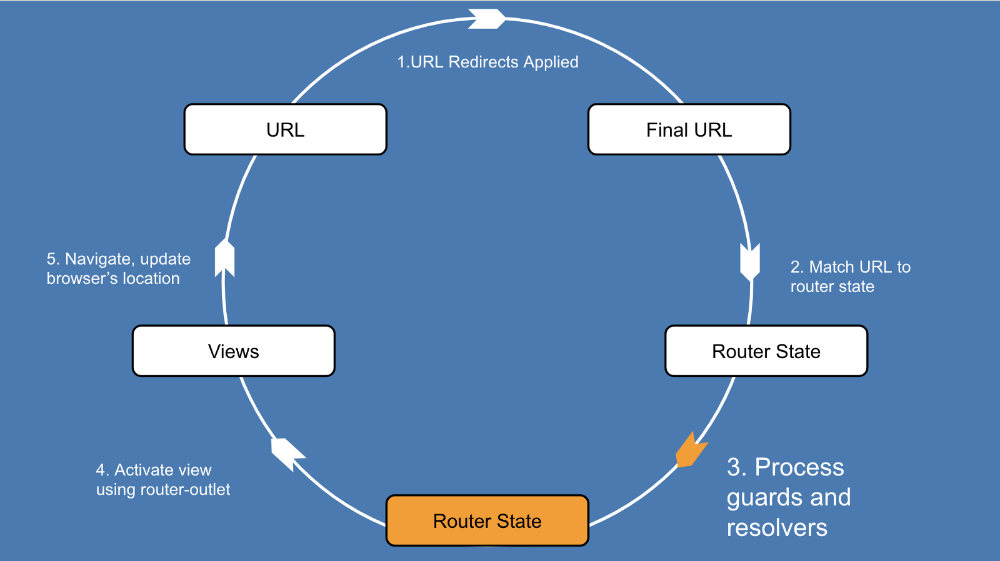

路由对于任何前端框架或库都是必不可少的。它允许我们加载应用程序一次，并通过客户端路由向用户显示不同的内容，从而使单页面应用成为可能。 

Angular的路由器使用起来很简单，但是你有没有想过在单击Angular应用程序中的链接时会发生什么？在本文中，我们将回答这个问题以及更多问题。  
**通过了解路由器的导航周期，可以更深入的了解Angular工作原理。**

<!--more-->

通过本文，您将了解路由器导航相关的如下三个问题：  
1. 对于特定的url，应该被导航到哪一个组件？
2. 是否能通过路由导航到某个组件上？
3. 是否需要在导航到这些组件之前获取一些数据？

过程中，我们将详细介绍以下内容：
1. 路由器导航从开始到结束的整个处理过程。
2. 路由器在导航期间和之后如何构建和使用ActivatedRouteSnapshot对象树。
3. 使用``<router-outlet>``指令呈现内容。


下面让我们跟着生命周期执行步骤，看看我们在Angular应用程序中路由时会发生什么。

## 导航
Angular创建的是一个单页面应用程序。这意味着每当URL更改时，我们实际上不会从服务器加载新页面。而是由路由器在浏览器中提供基于位置的导航，[这对单页应用程序至关重要](https://blog.angular-university.io/why-a-single-page-application-what-are-the-benefits-what-is-a-spa/)。它允许我们更改用户看到的内容以及URL，而无需刷新页面。  

只要URL发生更改，就会发生导航（路由）。我们需要一种在应用程序中的视图之间导航的方法，但不能使用锚点href，因为会触发整页重新加载。Angular为我们提供``[routerLink]``指令来解决这个问题。单击时，它会告诉路由器更新URL并使用``<router-outlet>``指令呈现内容，而无需重新加载页面。
```html
<!-- 不使用routerLink指令 -->
<a href='localhost:4200/users'>Users</a>  <!-- 不是我们想要的！ -->
<!-- 使用routerLink指令 -->
<a [routerLink]="['/users']">Users</a>  <!-- 路由器将接管处理 -->
```
>代码来源于[由GitHub托管的原始links_example.html](https://gist.github.com/nathan-lapinski/6574366a77a295900e94a3e89bdc8646#file-links_example-html) 

对于每次导航，在路由器在屏幕上呈现新组件之前会发生一系列步骤。这称为路由器导航生命周期。

导航成功后新组件被渲染到``<router-outlet>``指令指定的地方，并且创建ActivatedRoute数据结构树作为导航的可查询记录。[如果您想了解有关激活路由和路由器状态的更多信息，我在这里已经写过了](https://blog.angularindepth.com/angular-routing-series-pillar-1-router-states-and-url-matching-12520e62d0fc)。本文研究的是路由器导航的生命周期，因此我们只需知道路由器和开发人员都使用激活的路由来提取有关导航的信息，例如查询参数和组件。

## 示例应用
我们将使用一个非常简单的应用程序作为运行示例。  
下面是路由器配置
```typescript
const ROUTES = [
  { path: 'users',
    component: UsersComponent,
    canActivate: [CanActivateGuard],
    resolve: {
      users: UserResolver
    }
  }
];
```
>代码来源于[GitHub托管的原始app.module.ts](https://gist.github.com/nathan-lapinski/6eb09a5800f843b2853907c6bae8174d#file-app-module-ts)  
完整的示例代码查看 [这里](https://stackblitz.com/edit/angular-pillar-two-navigation-demo?embed=1&file=src/app/app.component.ts) 或 [这里](https://stackblitz.com/edit/angular-pillar-two-navigation-demo?embed=1&file=src/app/app.component.ts)。

该应用程序由一个路由组成，该路由通过``/users``查询参数判断用户是否已登录（``login=1``），然后显示它从模拟API服务检索的用户名列表。

应用程序的细节并不重要。我们只需要一个示例来查看导航周期。
 
## 导航周期和路由器事件
查看导航周期的一个好方法是订阅路由器服务的``events``可观察性：
```typescript
constructor(private router: Router) {
  this.router.events.subscribe( (event: RouterEvent) => console.log(event))
}
```
>代码来源于[GitHub托管的原始原始router_event_sub.ts](https://gist.github.com/nathan-lapinski/d21f92315879141df5faf8ca16fc49e2#file-router_event_sub-ts) 

在开发过程中，您还可以传递``enableTracing: true``路由器配置中的选项。
```typescript
RouterModule.forRoot(ROUTES, {
  enableTracing: true
})
```
>代码来源于[GitHub托管的原始原始app.component.ts](https://gist.github.com/nathan-lapinski/f8451d71f393a0b45b7723e107265008#file-app-component-ts) 

在开发人员控制台中，我们可以看到导航到``/users``路径期间发出的事件：

这些事件对于研究或调试路由器非常有用。您也可以轻松点击它们以在导航期间显示加载消息。
```typescript
ngOnInit() {
  this.router.events.subscribe(evt => { 
    if (evt instanceof NavigationStart) {
      this.message = 'Loading...';
      this.displayMessage = true;
    }
    if (evt instanceof NavigationEnd) this.displayMessage = false;
  });
}
```  
>摘自[app.component.ts](https://gist.github.com/nathan-lapinski/a833c85b7616ffa46f77631bb930d5ef#file-app-component-ts) 。在导航开始时显示加载消息，并在导航结束后清除消息。

下面让我们浏览导航/users。

## 导航开始
*事件：NavigationStart*
在我们的示例应用程序中，用户首先单击以下链接：
```html
<a [routerLink]="['/users']" [queryParams]="{'login': '1'}">Authorized Navigation</a>
```
>代码摘自[app.component.html](https://gist.github.com/nathan-lapinski/70811b0d5583d9c620fc6f6e8cccbdc0#file-app-component-html) 。导航到``/users``，并传递查询参数``login = 1``（请参阅路由器防护部分）。

每当路由器检测到路由器链接指令上的单击时，它就会启动导航循环和必要导航方法，例如路由器服务``navigate``和``navigateByUrl``方法。  

以前，可能会有多个导航同时运行（因此需要导航ID），[但是通过此更改，一次只能有一个导航](https://github.com/angular/angular/commit/b7baf632c0161692f15d13f718329ab54a0f938a)。

## 网址匹配和重定向
*事件：RoutesRecognized*

路由器首先通过路由器配置数组（我们示例中的``ROUTES``）进行深度优先搜索，然后尝试将URL与路由器配置中的``/users``的某个``path``属性进行匹配，同时应用任何重定向。[如果你想详细了解这个过程，我在这里写了一下](https://blog.angularindepth.com/angular-routing-series-pillar-1-router-states-and-url-matching-12520e62d0fc#3284)。  

在我们的示例中，没有重定向要担心，并且URL ``/users`` 将匹配以下配置``ROUTES``：  
>``{path：'users'，component：UsersComponent，...}``

如果匹配的路径需要延迟加载的模块，则此时将加载它。

路由器发出一个``RoutesRecognized``事件来表示它已找到匹配的URL，以及一个要导航到（UsersComponent）的组件。这回答了路由器的第一个问题，“我应该导航到什么？”。但事情并没有结束，路由器必须确保允许导航到这个新组件。这就是下面的路线防护。

## 路线卫兵
*事件：GuardsCheckStart，GuardsCheckEnd*

路径保护是布尔函数，路由器使用它来确定它是否可以执行导航。**作为开发人员，我们使用警卫来控制是否可以进行导航**。在我们的示例应用程序中，我们使用[canActivate](https://angular.io/api/router/CanActivate)防护来通过在路由配置中指定用户来检查用户是否已登录。
>``{path：'users'，...，canActivate：[CanActivateGuard]}``

保护功能如下所示。
```typescript
canActivate(route: ActivatedRouteSnapshot, state: RouterStateSnapshot): boolean {
    return this.auth.isAuthorized(route.queryParams.login);
}
```
>代码摘自[can-activate.guard.ts](https://gist.github.com/nathan-lapinski/f0a027034250de54ae80cc443ae3cf8a#file-can-activate-guard-ts) 。当查询参数``login = 1``时，isAuthorized将返回true。

此保护将``login``查询参数传递给``auth``服务（``auth.service.ts``在示例应用程序中）。

如果调用``isAuthorized(route.queryParams.login)``返回``true``，则通过防护。否则，防护失败，路由器发出``NavigationCancel``事件，并中止整个导航。

其他防护包括[canLoad](https://angular.io/api/router/CanLoad)（模块是否应该延迟加载），[canActivateChild](https://angular.io/api/router/CanActivateChild)和[canDeactivate](https://angular.io/api/router/CanDeactivate)（这对于防止用户导航离开页面非常有用，例如，在填写表单时）。

警卫与服务类似，他们注册为提供者并可注射。每当URL发生变化时，路由器都会运行防护。

**canActivate防护在为路由获取任何数据之前运行，因为没有理由获取不应激活的路由的数据**。一旦警卫通过，路由器已经回答了第二个问题，“我应该执行此导航吗？”。路由器现在可以使用路由解析器预取任何数据。

## 路线解析器
*事件：ResolveStart，ResolveEnd*

路由解析器是我们可以在路由器呈现任何内容之前用于在导航期间预取数据的函数。与防护类似，我们使用``resolve``属性在路径配置中指定解析器：
> ``{path：'users'，...，resolve：{users：UserResolver}}``
```typescript
export class UserResolver implements Resolve<Observable<any>> {
  constructor(private userService: MockUserDataService) {}

  resolve(): Observable<any> {
    return this.userService.getUsers();
  }
}
```
>代码摘自[user.resolver.ts](https://gist.github.com/nathan-lapinski/08727ef15efe87375a3db7d474c90b3a#file-user-resolver-ts) 。

一旦路由器将URL与路径匹配，并且所有防护已经通过，它将调用类中``resolve``定义的方法``UserResolver``来获取数据。路由器将结果存储在密钥下的``ActivatedRoute``服务``data``对象上``users``。订阅``ActivatedRoute``服务的``dataobservable`` 可以读取此信息。
>``activatedRouteService.data.subscribe（data => data.users）;``

[ActivatedRoute](https://angular.io/api/router/ActivatedRoute)服务在UsersComponent的内部使用，用来检索来自解析器的数据。
```typescript
export class UsersComponent implements OnInit {
  public users = [];

  constructor(private route: ActivatedRoute) {}

  ngOnInit() {
    this.route.data.subscribe(data => this.users = data.users);
  }
}
```
>代码摘自[users.component.ts](https://gist.github.com/nathan-lapinski/f91f111fc59a8b77762b67056d6f6055#file-users-component-ts) 。

**解析器让我们在路由期间预取组件数据**。此技术可用于通过预取任何数据来避免向用户显示部分加载的模板。请记住，组件的模板在用户期间是可见的``OnInit``，因此获取需要在该生命周期钩子中呈现的任何数据可能导致部分页面加载。

**但是，通常最好让页面部分加载**。如果做得好，它将增加用户对网站的感知表现。是否预取数据的决定取决于你，但通常最好是部分页面加载一个很好的加载动画而不是使用解析器。

在内部，路由器具有``runResolve``方法，该方法将执行解析程序，并将其结果存储在``ActivatedRoute``快照上。
```typescript
future.data = {...future.data,
               ...inheritedParamsDataResolve(future, paramsInheritanceStrategy).resolve};
```
>代码摘自[pre_activation.ts](https://gist.github.com/nathan-lapinski/36e46b4dc269fa72a775e8484832b8ce#file-pre_activation-ts) 。“future”与``ActivatedRouteSnapshot``一样.

一旦路由器处理完所有解析器，下一步就是使用适当的路由器插座开始渲染组件。

## 激活路由
*事件：ActivationStart，ActivationEnd，ChildActivationStart，ChildActivationEnd*

现在是时候激活组件，并使用``a``显示它们``<router-outlet>``。路由器可以从导航周期的前一步骤中构建的``ActivatedRouteSnapshots``树中提取有关组件的信息。


> component属性告诉路由器创建并激活UsersComponent的实例。我们还可以看到我们在data.users属性下获取的用户

如果您不熟悉在Angular中创建动态组件的过程，那么[这里](https://blog.angularindepth.com/here-is-what-you-need-to-know-about-dynamic-components-in-angular-ac1e96167f9e)和[这里](https://netbasal.com/dynamically-creating-components-with-angular-a7346f4a982d)都有很好的解释。
所有的魔力都发生在路由器的activateWith功能中：
```typescript
activateWith(activatedRoute: ActivatedRoute, resolver: ComponentFactoryResolver|null) {
  if (this.isActivated) {
    throw new Error('Cannot activate an already activated outlet');
  }
  this._activatedRoute = activatedRoute;
  const snapshot = activatedRoute._futureSnapshot;
  const component = <any>snapshot.routeConfig !.component;
  resolver = resolver || this.resolver;
  const factory = resolver.resolveComponentFactory(component);
  const childContexts = this.parentContexts.getOrCreateContext(this.name).children;
  const injector = new OutletInjector(activatedRoute, childContexts, this.location.injector);
  this.activated = this.location.createComponent(factory, this.location.length, injector);
  // Calling `markForCheck` to make sure we will run the change detection when the
  // `RouterOutlet` is inside a `ChangeDetectionStrategy.OnPush` component.
  this.changeDetector.markForCheck();
  this.activateEvents.emit(this.activated.instance);
}
```
>代码摘自[router_outlet.ts](https://gist.github.com/nathan-lapinski/6ac2b51ba59baf68bd3587fbd500df41#file-router_outlet-ts) 。

不要强调细节，我将在这里总结代码的要点：
- 在第9行，``ComponentFactoryResolver``用于创建一个实例``UsersComponent``。路由器从第7行的``ActivatedRouteSnapshot``中提取此信息。
- 在第12行，实际创建了组件。``location``是针对该``<router-outlet>``目标的``ViewContainerRef``。如果您曾经想知道为什么渲染内容被放置为``<router-outlet>``与其内部相对的兄弟，可以通过[遵循内部细节找到详细信息createComponent](https://github.com/angular/angular/blob/master/packages/core/src/view/refs.ts#L199)。
- 在创建并激活组件之后，``activateChildRoutes``调用（未示出）。这样做是为了解释任何嵌套的``<router-outlet>``，称为子路由。
路由器将在屏幕上呈现组件。如果呈现的组件具有任何嵌套``<router-outlet>``元素，则路由器将遍历并呈现这些元素。

## 更新URL

导航周期的最后一步是将URL更新为``/users``。
```typescript
private updateTargetUrlAndHref(): void {
  this.href = this.locationStrategy.prepareExternalUrl(this.router.serializeUrl(this.urlTree));
}
```
>代码摘自[router_link.ts](https://gist.github.com/nathan-lapinski/8d8fb69970d1decf43ab87dee4fd0917#file-router_link-ts) 。

路由器现在已准备好侦听另一个URL更改，并重新开始循环。

。。。

在本系列的最后一部分中，我们将深入研究路由器的延迟加载模块机制。感谢阅读，敬请期待！

感谢 [Tim Deschryver](https://medium.com/@timdeschryver?source=post_page)和[Alex Okrushko](https://medium.com/@alex.okrushko)。

原文：[Angular Router Series: Pillar 2 — Understanding The Router’s Navigation Cycle](https://blog.angularindepth.com/angular-router-series-pillar-2-navigation-d050286bf4fa)